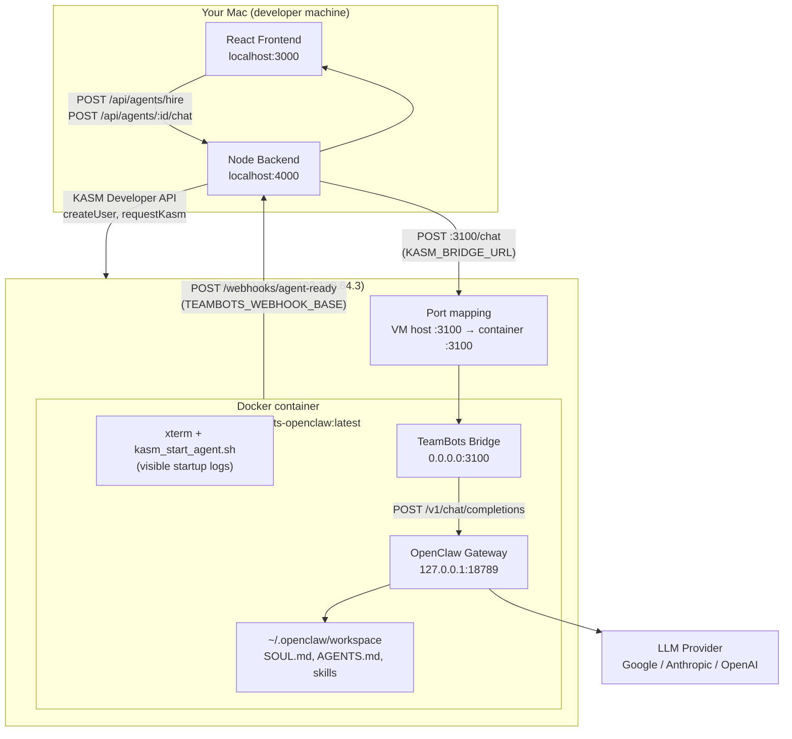

# TeamBots KASM Agent — Complete Workflow & Architecture Guide

This document explains **how the entire system works**, from the React UI down to the OpenClaw Docker container inside KASM. Read this if you are new to the project or need to set up, debug, or extend the agent platform.

For quick setup commands, see [README.md](./README.md).

---

## Table of contents

1. [What this project does (one paragraph)](#1-what-this-project-does-one-paragraph)
2. [Architecture diagram (top to bottom)](#2-architecture-diagram-top-to-bottom)
3. [The hire → chat lifecycle (step by step)](#3-the-hire--chat-lifecycle-step-by-step)
4. [How KASM port mapping works](#4-how-kasm-port-mapping-works)
5. [The Docker image (entry point)](#5-the-docker-image-entry-point)
6. [What runs inside the container](#6-what-runs-inside-the-container)
7. [Backend modules](#7-backend-modules)
8. [Frontend modules](#8-frontend-modules)
9. [Configured agent profiles](#9-configured-agent-profiles)
10. [Scripts reference](#10-scripts-reference)
11. [Environment variables](#11-environment-variables)
12. [Ports summary](#12-ports-summary)
13. [Logs and debugging](#13-logs-and-debugging)
14. [Full setup procedure (checklist)](#14-full-setup-procedure-checklist)
15. [Common misconceptions](#15-common-misconceptions)

---

## 1. What this project does (one paragraph)

You open a **React web app**, pick an AI agent role (e.g. Marketing Researcher), paste an LLM API key, and click **Hire**. The **backend** asks **KASM** to start a **Docker container** (your custom OpenClaw image) on the KASM VM. Inside that container, **OpenClaw** talks to Gemini/Claude/GPT, and a small **bridge** server relays chat between your Mac and OpenClaw. When the container is ready, it notifies the backend; the UI opens a **chat page**. Every message you send goes: **React → backend → bridge (port 3100) → OpenClaw gateway (port 18789) → LLM → back to you**.

---

## 2. Architecture diagram (top to bottom)

### High-level view



### Layer-by-layer (simple)

| Layer | Where it runs | What it does |
|-------|---------------|--------------|
| **Frontend** | Mac, port 3000 | Hire form, chat UI, status polling |
| **Backend** | Mac, port 4000 | KASM API calls, agent registry, forwards chat to bridge |
| **KASM VM** | UTM / cloud VM | Runs workspace containers, publishes ports to VM IP |
| **Docker container** | Inside KASM | OpenClaw + bridge + startup scripts |
| **OpenClaw gateway** | Inside container, loopback | Agent runtime, LLM calls, skills |
| **TeamBots bridge** | Inside container, port 3100 | HTTP API the backend calls for `/chat` |
| **LLM provider** | Internet | Gemini, Claude, or GPT API |

---

## 3. The hire → chat lifecycle (step by step)

### Phase A — Hire (provisioning)

| Step | Who | What happens |
|------|-----|----------------|
| 1 | User | Selects agent profile, LLM provider/model, API key; clicks **Hire** |
| 2 | Frontend | `POST /api/agents/hire` with role, skills, `llm_api_key`, etc. |
| 3 | Backend `hire.js` | Creates unique `agent_id`, `bridgeToken`, KASM username/password |
| 4 | Backend | `kasmApi.createUser()` — registers a throwaway KASM user |
| 5 | Backend | `kasmApi.requestKasm()` — starts container with **environment variables** (see below) |
| 6 | Backend | `kasmApi.waitForRunning()` — polls until KASM reports container running |
| 7 | Backend | Returns `202` with `status: kasm_running`; frontend polls `GET /api/agents/:id` |
| 8 | KASM | Runs `custom_startup.sh` → opens xterm → runs `kasm_start_agent.sh` |
| 9 | Container | Writes OpenClaw config, seeds workspace, starts gateway + bridge |
| 10 | Container | `POST {TEAMBOTS_WEBHOOK_BASE}/webhooks/agent-ready` with `bridgeToken` |
| 11 | Backend | Sets agent `status: ready` |
| 12 | Frontend | Auto-navigates to `/chat/:agentId` |

**Environment variables injected at hire time** (via KASM `request_kasm` → `environment` field):

| Variable | Purpose |
|----------|---------|
| `AGENT_ID` | Unique agent identifier |
| `AGENT_ROLE` | e.g. `Marketing Researcher` |
| `AGENT_JOB_TITLE` | Job title shown in workspace files |
| `SPONSOR_NAME` | User/sponsor name for `USER.md` |
| `LLM_PROVIDER` | `google`, `anthropic`, or `openai` |
| `LLM_MODEL` | e.g. `gemini-2.0-flash` |
| `LLM_API_KEY` | User's API key for the LLM |
| `SKILLS` | Comma-separated [ClawHub](https://clawhub.ai/skills) skill slugs |
| `TEAMBOTS_TOKEN` | Secret token for bridge auth + webhook |
| `TEAMBOTS_WEBHOOK` | Base URL for agent-ready webhook, e.g. `http://192.168.64.1:4000/webhooks` |

### Phase B — Chat (runtime)

| Step | Who | What happens |
|------|-----|----------------|
| 1 | User | Types message in chat UI, presses Enter |
| 2 | Frontend | `POST /api/agents/:agentId/chat` with `message`, `conversation_id` |
| 3 | Backend `chat.js` | Checks agent is `ready`, reads `KASM_BRIDGE_URL` |
| 4 | Backend | `POST http://<kasm-vm-ip>:3100/chat` with `Authorization: Bearer <bridgeToken>` |
| 5 | Bridge | Validates token, forwards to OpenClaw `POST /v1/chat/completions` on `127.0.0.1:18789` |
| 6 | OpenClaw | Runs agent with workspace context (SOUL.md, AGENTS.md), calls LLM |
| 7 | Bridge | Returns JSON `{ message, role, agent_id, ... }` |
| 8 | Backend | Passes response to frontend |
| 9 | Frontend | Displays assistant bubble |

**Important:** Chat does **not** go through the xterm terminal. It uses HTTP in the background. The xterm only shows startup logs and heartbeat lines every 30 seconds.

### Phase C — Terminate (Fire)

| Step | Who | What happens |
|------|-----|----------------|
| 1 | User | Clicks **Fire** in chat UI |
| 2 | Backend | `DELETE /api/agents/:id` → `kasmApi.destroyKasm()` |
| 3 | KASM | Destroys the session/container |

---

## 4. How KASM port mapping works

### The problem

KASM containers live on an **internal Docker network** (e.g. `172.18.x.x`). Your Mac **cannot** reach `172.18.x.x:3100` directly. So the backend cannot call the bridge unless something publishes the port to an address your Mac can reach.

### The solution — Approach 2 (port mapping)

KASM workspaces support a **Docker Run Config Override** — JSON that maps to [docker-py `Container.run()`](https://docker-py.readthedocs.io/) keyword arguments.

Publish container port **3100** to the **KASM VM host** port **3100**:

```json
{
  "ports": {
    "3100/tcp": 3100
  }
}
```

This is equivalent to `docker run -p 3100:3100`.

### Traffic flow after mapping

```
Mac backend
  → http://192.168.64.3:3100/chat     (KASM VM IP + mapped host port)
    → KASM forwards to container :3100
      → bridge/server.js
        → http://127.0.0.1:18789/v1/chat/completions
          → OpenClaw gateway (loopback only — not published externally)
```

### What is NOT port-mapped

| Port | Service | Why |
|------|---------|-----|
| **18789** | OpenClaw gateway | Stays on `127.0.0.1` inside container; only bridge talks to it |
| **4000** | Mac backend | Reached via `TEAMBOTS_WEBHOOK_BASE` from container (reverse direction) |

### Configuration checklist for port mapping

1. **KASM Admin → Workspaces → your workspace → Docker Run Config Override:**

   ```json
   { "ports": { "3100/tcp": 3100 } }
   ```

   Use `ports`, **not** `port_map` (invalid in docker-py → KASM hire fails).

2. **Backend `.env`:**

   ```env
   KASM_BRIDGE_URL=http://192.168.64.3:3100
   ```

   Use the **KASM VM IP**, not `localhost`, not the container IP.

3. **Verify from Mac:**

   ```bash
   curl -sf http://192.168.64.3:3100/health
   ```

4. **Verify inside container:**

   ```bash
   curl -sf http://127.0.0.1:3100/health
   ```

Both should return JSON with `ok: true`.

### Webhook direction (separate from port mapping)

The container must reach your **Mac backend** for `agent-ready`:

```env
TEAMBOTS_WEBHOOK_BASE=http://192.168.64.1:4000
```

On Mac + UTM, `192.168.64.1` is typically the UTM host-only gateway (run `ip route show default` inside the KASM VM to confirm). This is **not** the same as `KASM_BRIDGE_URL`.

---

## 5. The Docker image (entry point)

The Docker image is the **foundation**. You build it once, push to a registry, register it as a KASM workspace, and every hired agent runs on top of it.

### Base image

```dockerfile
FROM kasmweb/core-ubuntu-jammy:1.17.0
```

Official [KASM](https://kasmweb.com/) Ubuntu desktop image — provides the browser-accessible desktop, `kasm-user`, and startup hooks.

### What gets installed (layer by layer)

| Layer | What | Why |
|-------|------|-----|
| System packages | `curl`, `jq`, `python3`, `openssl`, `xterm` | Scripts, config generation, visible terminal |
| **Node.js 22** | From NodeSource | OpenClaw 2026.6.1 requires Node ≥ 22.19 |
| **OpenClaw 2026.6.1** | `npm install -g openclaw@2026.6.1` | Pinned — npm `latest` tag is a broken placeholder |
| **Bridge** | `bridge/` + `npm install` | TeamBots HTTP relay inside container |
| **Scripts** | `scripts/`, `kasm_start_agent.sh`, `custom_startup.sh` | Startup, config, tests |
| **openclaw_models.js** | Model ID mapping | Registers Gemini models not in OpenClaw catalog |
| **KASM hook** | Copies `custom_startup.sh` → `$STARTUPDIR/` | KASM runs this when session starts |
| **Permissions** | `chown 1000:1000` on `~/.openclaw`, `/opt/teambots_openclaw` | `kasm-user` can write configs at runtime |

### Build and push

```bash
# From project root
docker buildx build \
  -f docker/Dockerfile \
  --platform linux/amd64,linux/arm64 \
  --tag yourdockerhubuser/teambots-openclaw:latest \
  --push .
```

### Register in KASM Admin

1. **Workspaces → Add Workspace**
2. Docker image: `yourdockerhubuser/teambots-openclaw:latest`
3. Memory: **≥ 2048 MB**
4. Docker Run Config Override: `{ "ports": { "3100/tcp": 3100 } }`
5. Copy the **Image ID** (32-char hex) → put in `KASM_IMAGE_ID` in backend `.env`
6. Force-pull image after each rebuild

### File layout inside the image

```
/opt/teambots_openclaw/
├── bridge/
│   ├── server.js          ← HTTP server on :3100
│   ├── openclaw_models.js
│   └── package.json
├── scripts/
│   ├── generate-openclaw-config.js
│   ├── seed-agent-workspace.js
│   ├── test-bridge.sh
│   └── ...
├── kasm_start_agent.sh    ← Main agent startup
├── custom_startup.sh      ← KASM session hook (also copied to /dockerstartup/)
└── openclaw_models.js     ← Flat copy for require() paths

/home/kasm-user/
├── .openclaw/             ← Created at runtime (config + workspace)
└── .teambots/             ← Tokens and logs
```

---

## 6. What runs inside the container

### 6.1 `custom_startup.sh` — KASM session hook

- Runs automatically when the KASM browser session starts
- Waits 2 seconds for desktop
- Opens an **xterm** titled "TeamBots Agent" so you can see logs
- Runs `kasm_start_agent.sh` (from `~/kasm_start_agent.sh` if copied, else `/opt/teambots_openclaw/`)
- Keeps shell open after exit for debugging

### 6.2 `kasm_start_agent.sh` — Main startup sequence

| Step | Action |
|------|--------|
| 1 | Create log dirs (`~/.teambots/logs`) |
| 2 | Validate `LLM_API_KEY` is set |
| 3 | Generate gateway token → `~/.teambots/token` |
| 4 | Run `generate-openclaw-config.js` → writes `~/.openclaw/openclaw.json` |
| 5 | Run `seed-agent-workspace.js` → writes SOUL.md, AGENTS.md, IDENTITY.md, USER.md; sets `skipBootstrap` |
| 6 | `openclaw config validate` — abort if invalid |
| 7 | Install ClawHub skills from `SKILLS` env (optional) |
| 8 | Start `openclaw gateway run --port 18789 --force` (background) |
| 9 | Wait for `/healthz` and `/readyz` on gateway |
| 10 | Start `node bridge/server.js` on port 3100 (background) |
| 11 | Wait for bridge `/health` |
| 12 | POST `agent-ready` webhook to Mac backend |
| 13 | Heartbeat loop every 30s (gateway + bridge health) |

### 6.3 `generate-openclaw-config.js`

Writes OpenClaw **2026.6.x** config:

- `gateway.mode: local`, `bind: loopback`, `auth.mode: token`
- Enables `chatCompletions` HTTP endpoint
- Sets primary model (e.g. `google/gemini-2.0-flash`)
- Registers custom Gemini models (e.g. `gemini-3.5-flash`) if needed
- Sets `tools.web.search.enabled` per hire (`TEAMBOTS_ENABLE_WEB_SEARCH`, role-based from UI)
- Uses `tools.profile: messaging` when web search is on (includes `web_search`/`web_fetch`); `minimal` when off
- Optional `tools.allow: bundle-mcp` when MCP servers configured via `TEAMBOTS_MCP_SERVERS`
- Sets `skipBootstrap: true`

### 6.4 `seed-agent-workspace.js`

Pre-fills workspace so OpenClaw does **not** ask "what's your name/vibe/emoji?":

- `AGENTS.md` — operating rules for the hired role
- `SOUL.md` — persona and role
- `IDENTITY.md` — name, emoji
- `USER.md` — sponsor info
- Deletes `BOOTSTRAP.md` if present

### 6.5 OpenClaw gateway (port 18789)

- **OpenClaw** agent runtime ([openclaw.ai](https://docs.openclaw.ai))
- Listens on `127.0.0.1:18789` (loopback — not exposed outside container)
- Exposes `/healthz`, `/readyz`, `/v1/chat/completions`
- Calls LLM provider using `GEMINI_API_KEY` / `ANTHROPIC_API_KEY` / `OPENAI_API_KEY`
- Loads workspace files into agent context

### 6.6 TeamBots bridge (port 3100)

- Small Express server (`bridge/server.js`)
- **`GET /health`** — liveness; returns `agent_id`, `role`
- **`GET /artifacts/:filename`** — serves HTML/PDF/JSON/CSV deliverables from `~/.teambots/artifacts/`
- **`POST /chat`** — authenticated with `TEAMBOTS_TOKEN`; proxies to OpenClaw; parses artifact protocol and returns `artifacts[]`
- Logs to `~/.teambots/logs/bridge.log` and `bridge-stdout.log`

---

## 7. Backend modules

Location: `backend/`

### `server.js`

Express app entry point. Mounts routes, CORS, loads `.env`.

### Routes

| File | Endpoint | Purpose |
|------|----------|---------|
| `routes/hire.js` | `POST /api/agents/hire` | Create KASM user, start container, inject env vars |
| `routes/chat.js` | `POST /api/agents/:agentId/chat` | Forward message to `KASM_BRIDGE_URL/chat` |
| `routes/artifacts.js` | `GET /api/agents/:agentId/artifacts/:filename` | Proxy deliverables from bridge |
| `routes/agents.js` | `GET /api/agents`, `GET/DELETE /api/agents/:id` | List, status, terminate |
| `routes/webhooks.js` | `POST /webhooks/agent-ready` | Container tells backend "I'm ready" |

### Services

| File | Purpose |
|------|---------|
| `services/kasmApi.js` | Wrapper for KASM Developer API (`createUser`, `requestKasm`, `waitForRunning`, `keepalive`, `destroyKasm`) |
| `services/registry.js` | In-memory store of hired agents (status, tokens, kasm IDs) |
| `services/logger.js` | Winston loggers → `backend/logs/*.log` |

### Agent status values

| Status | Meaning |
|--------|---------|
| `provisioning` | Hire started, KASM user created |
| `kasm_provisioning` | `requestKasm` sent |
| `kasm_running` | Container running, waiting for webhook |
| `ready` | Bridge up, chat enabled |
| `error` | Hire or startup failed |

---

## 8. Frontend modules

Location: `frontend/src/`

| File | Purpose |
|------|---------|
| `App.js` | Routes: `/` (hire), `/chat/:agentId` |
| `pages/HirePage.jsx` | Agent cards, LLM picker, API key form, hire + status polling |
| `pages/ChatPage.jsx` | Chat bubbles, send message, Fire agent |
| `services/agentProfiles.js` | Agent role definitions (see [§9](#9-configured-agent-profiles)) |
| `services/api.js` | Axios calls to backend |
| `components/AgentCard.jsx` | Hire page agent tile |
| `components/ChatBubble.jsx` | Message bubble UI + artifact cards |
| `components/ArtifactCard.jsx` | Preview, open, download, PDF link for deliverables |
| `components/StatusBadge.jsx` | provisioning / ready / error badge |

---

## 9. Configured agent profiles

Defined in `frontend/src/services/agentProfiles.js`. One **Docker image** serves all roles; the hired role is passed via environment variables and workspace seeding.

| Profile ID | Role | Default skills (ClawHub) | Typical use |
|------------|------|--------------------------|-------------|
| `general` | General Assistant | none | Everyday Q&A |
| `invoice` | Invoice Agent | `invoice` | Invoices, billing |
| `marketing` | Marketing Researcher | `summarize` | Market research, web search enabled |
| `competitive` | Competitive Intelligence Analyst | `summarize`, `github` | Competitor tracking, web search enabled |
| `content` | Content Brief Writer | `summarize` | Content briefs, outlines |
| `sales` | Sales Outreach Assistant | `summarize` | Outreach copy |
| `support` | Customer Support Triage Agent | `summarize` | Ticket triage |
| `engineering` | Engineering Research Assistant | `summarize`, `github` | Tech research |

Skills are installed at container startup via `openclaw skills install <slug>`. Browse available skills at [ClawHub](https://clawhub.ai/skills).

### Supported LLM providers

| Provider | Example models |
|----------|----------------|
| Google (Gemini) | `gemini-3.5-flash`, `gemini-2.5-flash`, `gemini-2.0-flash`, … |
| Anthropic (Claude) | `claude-3-5-sonnet-20241022`, … |
| OpenAI (GPT) | `gpt-4o`, `gpt-4o-mini`, … |

The user picks provider + model on the hire form; the API key is sent once at hire time and injected into the container as `LLM_API_KEY`.

---

## 10. Scripts reference

All under `scripts/` unless noted.

| Script | Runs where | Purpose |
|--------|------------|---------|
| `kasm_start_agent.sh` | Container | **Main entry** — gateway, bridge, webhook |
| `custom_startup.sh` | Container (KASM hook) | Launches xterm + startup script |
| `generate-openclaw-config.js` | Container | Writes valid `openclaw.json` |
| `seed-agent-workspace.js` | Container | Pre-seeds identity files, skips bootstrap Q&A |
| `test-bridge.sh` | Container | Quick `curl` chat test against local bridge |
| `test-bridge-invoice.sh` | Container | Invoice agent smoke test |
| `kasm-diagnose.sh` | **Mac** | List active KASM sessions via API |
| `kasm-cleanup-sessions.sh` | **Mac** | Destroy stale sessions (free slots) |
| `fix-openclaw-chat-api.sh` | Container | Repair chat completions config |
| `generate-token.sh` | Either | Generate random tokens |

---

## 11. Environment variables

### Backend (`backend/.env`)

| Variable | Required | Example | Purpose |
|----------|----------|---------|---------|
| `KASM_BASE_URL` | Yes | `https://192.168.64.3` | KASM VM URL |
| `KASM_API_KEY` | Yes | — | KASM Developer API key |
| `KASM_API_SECRET` | Yes | — | KASM API secret |
| `KASM_IMAGE_ID` | Yes | 32-char hex | Workspace image ID from KASM Admin |
| `KASM_VERIFY_SSL` | No | `false` | Disable SSL verify for self-signed certs |
| `KASM_BRIDGE_URL` | Yes | `http://192.168.64.3:3100` | Where backend sends chat requests |
| `TEAMBOTS_WEBHOOK_BASE` | Yes | `http://192.168.64.1:4000` | Where container sends agent-ready |
| `PORT` | No | `4000` | Backend listen port |
| `FRONTEND_URL` | No | `http://localhost:3000` | CORS origin |
| `KASM_CHAT_TIMEOUT_MS` | No | `120000` | Chat HTTP timeout |

### Injected into container at hire time

See [Phase A — Hire](#phase-a--hire-provisioning) table above.

---

## 12. Ports summary

| Port | Host | Service | Reachable from Mac? |
|------|------|---------|---------------------|
| 3000 | Mac | React frontend | Yes (localhost) |
| 4000 | Mac | Node backend | Yes (localhost + UTM IP for webhooks) |
| 3100 | KASM VM | TeamBots bridge (mapped) | Yes, if `ports` configured |
| 18789 | Container loopback | OpenClaw gateway | No (internal only) |
| 443/8443 | KASM VM | KASM web UI / API | Yes |

---

## 13. Logs and debugging

### On your Mac

```
backend/logs/
├── api.log       ← general API
├── hire.log      ← hire flow
├── chat.log      ← chat requests to bridge
├── webhook.log   ← agent-ready callbacks
└── kasm.log      ← KASM API calls
```

### Inside KASM container

```
~/.teambots/logs/
├── startup.log           ← kasm_start_agent.sh steps
├── openclaw-gateway.log  ← OpenClaw gateway stdout/stderr
├── bridge.log            ← bridge request log
├── bridge-stdout.log     ← bridge process stdout
└── skill-install.log     ← ClawHub skill installs
```

OpenClaw also writes: `/tmp/openclaw-1000/openclaw-*.log`

### Useful commands (inside KASM terminal)

```bash
# Bridge alive?
curl -sf http://127.0.0.1:3100/health | python3 -m json.tool

# Gateway alive?
curl -sf http://127.0.0.1:18789/healthz

# Watch chat traffic (NOT visible in xterm heartbeats)
tail -f ~/.teambots/logs/bridge.log

# Config valid?
openclaw config validate
cat ~/.openclaw/openclaw.json | head -30
```

### Useful commands (on Mac)

```bash
# Bridge reachable via port mapping?
curl -sf http://192.168.64.3:3100/health | python3 -m json.tool

# Active KASM sessions
bash scripts/kasm-diagnose.sh
```

---

## 14. Full setup procedure (checklist)

Use this order for a clean first-time setup.

### One-time: Build image

- [ ] Install Docker with `buildx`
- [ ] `docker buildx build -f docker/Dockerfile --platform linux/amd64,linux/arm64 --tag USER/teambots-openclaw:latest --push .`
- [ ] Verify `openclaw --version` in image shows `2026.6.1`

### One-time: KASM workspace

- [ ] KASM Workspaces running (UTM VM or cloud)
- [ ] KASM Admin → Add Workspace → image `USER/teambots-openclaw:latest`
- [ ] Memory ≥ 2048 MB
- [ ] Docker Run Config: `{ "ports": { "3100/tcp": 3100 } }`
- [ ] Copy Image ID → `KASM_IMAGE_ID`

### One-time: Backend config

- [ ] `cd backend && cp .env.example .env`
- [ ] Set `KASM_BASE_URL`, API key/secret, `KASM_IMAGE_ID`
- [ ] Set `KASM_BRIDGE_URL=http://<KASM-VM-IP>:3100`
- [ ] Set `TEAMBOTS_WEBHOOK_BASE=http://<MAC-UTM-IP>:4000`
- [ ] Allow port 4000 through macOS Firewall if webhook fails

### Every dev session

- [ ] Terminal 1: `cd backend && npm start`
- [ ] Terminal 2: `cd frontend && npm start`
- [ ] Open http://localhost:3000

### Hire and test

- [ ] Pick agent profile + LLM + API key → **Hire**
- [ ] Wait for status **Ready** (or open KASM session link)
- [ ] Send test message in chat
- [ ] If chat fails: check `backend/logs/chat.log` and `~/.teambots/logs/bridge.log`

### After code changes to container scripts

- [ ] Rebuild and push Docker image
- [ ] Force-pull in KASM Admin
- [ ] Destroy old sessions (`scripts/kasm-cleanup-sessions.sh`)
- [ ] Hire fresh agent

---

## 15. Common misconceptions

| Misconception | Reality |
|---------------|---------|
| "Nothing happens in xterm when I chat" | **Normal.** Chat uses HTTP to bridge :3100, not the shell. Check `bridge.log`. |
| "I need to configure LLM key in KASM workspace Docker env" | **Optional.** Hire form injects `LLM_API_KEY` per session. Workspace env is only a fallback default. |
| "Port mapping uses `port_map`" | **Wrong.** Use `"ports": {"3100/tcp": 3100}` (docker-py format). |
| "Gateway port 18789 must be mapped" | **No.** Only bridge :3100 needs mapping. Gateway stays on loopback inside container. |
| "`/health` on OpenClaw" | OpenClaw 2026.6+ uses **`/healthz`** (liveness) and **`/readyz`** (readiness). |
| "Agent-ready and chat use the same URL" | **No.** Webhook = Mac backend (`TEAMBOTS_WEBHOOK_BASE`). Chat = KASM VM (`KASM_BRIDGE_URL`). |
| "One container = one agent forever" | Each **Hire** creates a new KASM user + session. Fire destroys it. |
| "OpenClaw onboarding questions are correct" | **No** for TeamBots — means workspace wasn't seeded; run latest image with `seed-agent-workspace.js`. |

---

## Related docs

- [README.md](./README.md) — Quick start and troubleshooting
- [FAQ.md](./FAQ.md) — Common questions (xterm, tokens, webhooks, SOUL.md, ClawHub, IPs) table
- [use-case.md](./use-case.md) — Product use cases
- [OpenClaw docs](https://docs.openclaw.ai) — Gateway, config, skills
- [ClawHub skills](https://clawhub.ai/skills) — Installable agent skills
- [KASM Workspaces](https://kasmweb.com/) — Container streaming platform

---

*Document version: matches `teambots-openclaw-claude-version` Approach 2 (KASM port mapping) architecture.*
