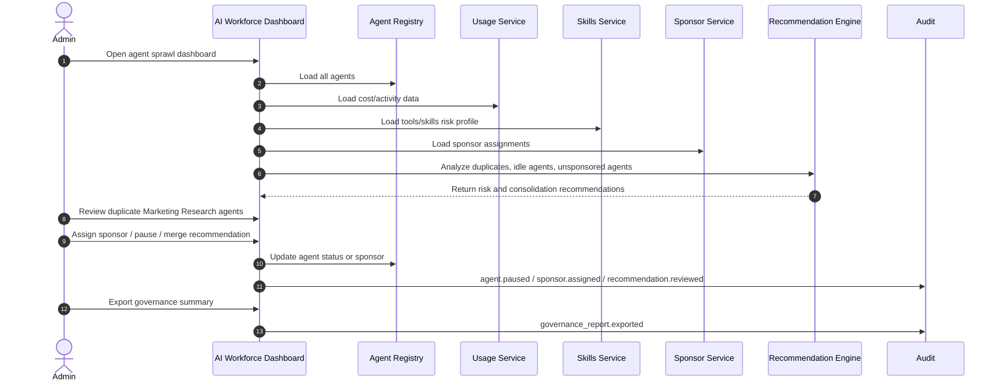

# UC-007: Agent Sprawl Governance

**Category:** Enterprise governance, lifecycle management  
**Primary value:** Shows how TeamBots helps enterprises manage duplicate, unmanaged, costly, risky AI agents.  
**MVP priority:** High  

---

## Goal

Shows how TeamBots helps enterprises manage duplicate, unmanaged, costly, risky AI agents.

---

## User Story

As a responsible business user, I want this TeamBots flow to be governed, visible, and easy to understand so I can safely delegate work to an AI teammate.

---

## Workflow Diagram

---

## Human Flow

1. Human starts from the relevant TeamBots or connected-app screen.
2. Human provides intent, configuration, approval, or task assignment.
3. Human receives clear feedback about what the TeamBot can do, what it cannot do, and what it will cost.
4. Human can approve, deny, revise, pause, or continue.

---

## Agent Flow

1. TeamBot receives the task or configuration update.
2. TeamBot reads profile, training files, memories, behavior rules, brain mapping, and skill permissions.
3. TeamBot chooses the safest available path: native SDK/API when available, workspace/browser when needed.
4. TeamBot executes only approved skills.
5. TeamBot asks for sponsor approval when required.
6. TeamBot produces status, artifact, summary, or recommendation.
7. TeamBot stops, sleeps, or waits for review according to behavior rules.

---

## System Flow

1. Platform validates organization, sponsor, agent status, and permissions.
2. Runtime checks brain mapping, skills, tools, budget, and sensitive-data rules.
3. Runtime invokes model/tool/workspace/SDK action.
4. Usage service records cost when a brain is used.
5. Audit service records material configuration or execution events.
6. Notification service alerts sponsor when approval, budget, or risk thresholds are involved.

---

## Governance / Risk Notes

- Every TeamBot action should be tied to an agent identity and sponsor.
- Skill enforcement must happen in the backend/runtime, not only in the UI.
- Sensitive data should override normal brain mapping and force private/safe routing.
- Budget controls are part of governance.
- External communication, destructive actions, and data export should require approval by default.
- Audit should be understandable by a business reviewer, not only by engineers.

---

## MVP Version

Build the visible product shape and configuration state first. Use stubs or simulations where deep runtime integrations are not ready, but keep the data model honest so the real integration can replace the stub later.

---

## Future Version

Replace stubs with live integrations: Kasm, OpenClaw, Slack, Gmail, Currents SDK, model routing, token metering, private Llama, TOZ AidP, and signed skills.

---

## Demo Moment

The demo moment should make the audience understand that a TeamBot is a managed AI coworker: identifiable, trained, governed, budgeted, auditable, and useful.

---

## Acceptance Criteria

- The human flow is clear.
- The agent flow is clear.
- The system flow is clear.
- The workflow diagram identifies the technical actors.
- The governance point is explicit.
- The MVP and future versions are separated.